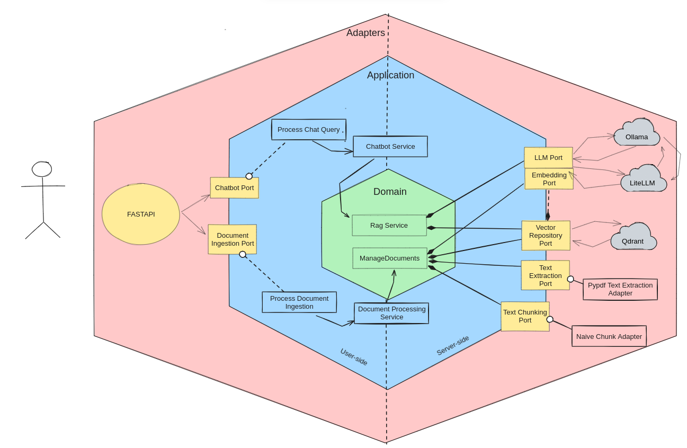

# 🧠 RAG with Hexagonal Architecture (FastAPI + LLM + Vector DB)

This project implements a **Retrieval-Augmented Generation (RAG)** pipeline featuring:

- **FastAPI** for the REST API layer
- **Multiple LLM providers** (Ollama, OpenAI, or litellm) for flexible language model integration
- **Qdrant** as the vector database for semantic similarity search
- **Hexagonal Architecture** with ports & adapters pattern ensuring clean separation of concerns
- **Domain-Driven Design (DDD)** principles for modeling complex business logic with a ubiquitous language
- **Layered architecture** with distinct application, domain, and infrastructure boundaries for enhanced modularity and testability

---

## 📁 Project Structure

```
backend
├── config.py                  # Global configuration settings for the application
├── main.py                    # Application entry point - initializes FastAPI and dependencies
├── src
│   └── components
│       └── chatbot            # RAG Chatbot component following hexagonal architecture
│           ├── application    # Application layer
│           │   ├── ports      # Interfaces defining how to interact with the application core
│           │   │   ├── driven  # Interfaces that the application uses to communicate outward
│           │   │   │          # (e.g., VectorRepository, LLMProvider interfaces)
│           │   │   └── driving # Interfaces that allow external systems to use the application
│           │   │              # (e.g., ChatbotPort interface)
│           │   ├── services   # Implementation of application services that orchestrate use cases
│           │   │              # (e.g., ChatCompletionService)
│           │   └── use_case_handlers  # Business logic specific to each use case which are implemented with driving port interfaces
│           ├── domain         # Domain layer - core business rules and concepts
│           │   ├── entities   # Business objects with identity and lifecycle
│           │   │              # (e.g., Message, Conversation, Document)
│           │   ├── repositories # Repository interfaces for domain objects
│           │   │              # (e.g., DocumentRepository, ConversationRepository)
│           │   ├── services   # Domain services that operate on multiple entities
│           │   │              # (e.g., VectorEmbeddingService)
│           │   └── value_objects # Immutable objects without identity
│           │                  # (e.g., Embedding, Query, DocumentChunk)
│           └── infrastructure # Infrastructure layer - technical details and implementations
│               ├── adapters   # Connect the application to external systems
│               │   ├── driven # Implementations of ports the application uses
│               │   │          # (e.g., OpenAIAdapter, QdrantAdapter)
│               │   ├── driving # Implementations of ports to drive the application
│               │              # (e.g., ChatbotRESTAdapter)
│               ├── api        # API definition and routing
│               │   └── v1     # API version 1
│               │       ├── rag_routes.py # FastAPI route definitions for rag
│               │       ├── dto.py           # Data Transfer Objects for API requests/responses
│               ├── config     # Infrastructure-specific configuration
│               │              # (e.g., QdrantConfig, LLMConfig)
│               ├── di         # Dependency Injection configuration
│               └── repositories # Implementation of repository interfaces
│                   └── qdrant_vector_repository.py # Concrete implementation for Qdrant and persistence storage
└── uvicorn_debug.py          # Script for running the app in debug mode with uvicorn

```

---

## ⚙️ Key Concepts
- **Hexagonal Architecture**  
  Ports define *what the system needs*; adapters define *how it's fulfilled*.
  
- **RAG Process**
  1. A question is submitted to the API
  2. Vector search retrieves relevant documents
  3. LLM generates an answer based on those documents
  4. (Optionally) The interaction is logged in a database (WIP)

- **Swappable Adapters**
  - You can switch between OpenAI and Ollama LLM clients (WIP)
  - You can replace Qdrant with another vector store easily

---

## 🏁 Getting Started

1. Clone the repository
2. Install packages

```bash
docker compose up
make run
````

----

## 📌 License

MIT – feel free to use and adapt.
