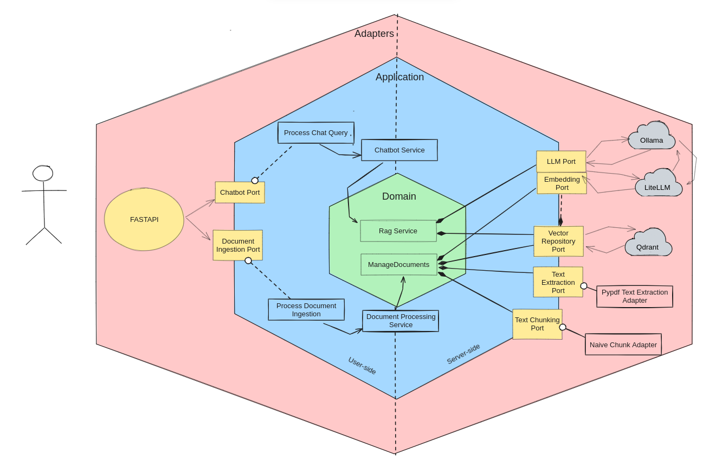
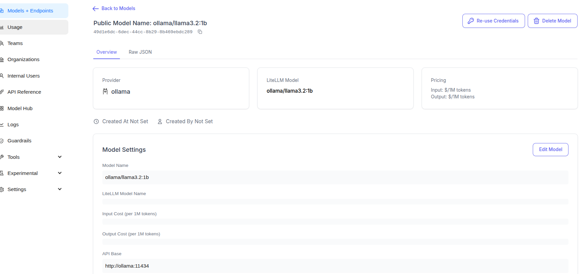

# 🧠 RAG with Hexagonal Architecture (FastAPI + LLM + Vector DB)

This project implements a **Retrieval-Augmented Generation (RAG)** pipeline featuring:

- **FastAPI** for the REST API layer
- **Multiple LLM providers** (Ollama, OpenAI, or litellm) for flexible language model integration
- **Qdrant** as the vector database for semantic similarity search
- **Hexagonal Architecture** with ports & adapters pattern ensuring clean separation of concerns
- **Domain-Driven Design (DDD)** principles for modeling complex business logic with a ubiquitous language
- **Layered architecture** with distinct application, domain, and infrastructure boundaries for enhanced modularity and testability

---

## 📁 Project Structure
```
backend/
├── config.py                  # Global configuration settings for the application
├── logs/                      # Application logs directory
├── main.py                    # Application entry point - initializes FastAPI and dependencies
├── src/
│   └── components/
│       └── rag/               # RAG component following hexagonal architecture
│           ├── application/   # Application layer
│           │   ├── handlers/  # Use case handlers implementing business logic
│           │   │              # (e.g., DocumentStoreHandler, QueryHandler)
│           │   └── ports/     # Interfaces defining how to interact with the application core
│           │       ├── driven/  # Interfaces that the application uses to communicate outward
│           │       │            # (e.g., EmbeddingPort, LLMPort, VectorStorePort)
│           │       └── driving/ # Interfaces that allow external systems to use the application
│           │                    # (e.g., DocumentStorePort, QueryPort)
│           ├── config/        # Component-specific configuration
│           │                  # (e.g., RAGConfig)
│           ├── domain/        # Domain layer - core business rules and concepts
│           │   ├── entities/  # Business objects with identity and lifecycle
│           │   │              # (e.g., QueryModel, RAGResponseModel)
│           │   ├── services/  # Domain services that operate on multiple entities
│           │   │              # (e.g., DocumentStoreService, QueryService)
│           │   └── value_objects/ # Immutable objects without identity
│           │                      # (e.g., Query, Embedding, Message, DocumentRetrieval)
│           ├── infrastructure/ # Infrastructure layer - technical details and implementations
│           │   ├── adapters/  # Connect the application to external systems
│           │   │   ├── driven/ # Implementations of ports the application uses
│           │   │   │           # (e.g., LiteLLMAdapter, DoclingAdapter)
│           │   │   └── driving/ # Implementations of ports to drive the application
│           │   ├── api/       # API definition and routing
│           │   │   ├── di/    # Dependency Injection configuration
│           │   │   └── v1/    # API version 1
│           │   │       ├── dto.py        # Data Transfer Objects for API requests/responses
│           │   │       └── rag_routes.py # FastAPI route definitions for RAG
│           │   └── persistence/ # Repository implementations and data access
│           │                    # (e.g., QdrantVectorStoreAdapter, QdrantVectorRetrieverAdapter)
│           └── tests/         # Test files following the same structure as source code
└── uvicorn_debug.py          # Script for running the app in debug mode with uvicorn
```

```
WIP: The project structure is subject to change as the project evolves.
```

---

## ⚙️ Key Concepts
- **Hexagonal Architecture**  
  Ports define *what the system needs*; adapters define *how it's fulfilled*.
  
- **RAG Process**
  1. A question is submitted to the API
  2. Vector search retrieves relevant documents
  3. LLM generates an answer based on those documents
  4. (Optionally) The interaction is logged in a database (WIP)

- **Swappable Adapters**
  - You can switch between OpenAI and Ollama LLM clients (WIP)
  - You can replace Qdrant with another vector store easily

---

## 🏁 Getting Started

1. **Clone the repository**
  ```bash
  git clone https://github.com/nicolasRossard/llm.git
  cd llm
  ```

2. **Configure litellm**
  - Clone the litellm project:
    ```bash
    git clone https://github.com/BerriAI/litellm
    ```
  - Modify the `docker-compose.yml` file to add the external network (you must create it first with `docker network create llm_net`):
    ```yaml
    networks:
     llm_net:
      external: true
    ```
  - Access the litellm interface :
    ```
    http://localhost:4000/ui
    ```
    (refer to documentation for credentials)
  - Configure the models as instructed in `ollama_entrypoint.sh` in litellm using the Ollama provider

Example for llama3.2 1B model:

```json
{
  "model_name": "ollama/llama3.2:1b",
  "litellm_params": {
    "api_base": "http://ollama:11434",
    "custom_llm_provider": "ollama",
    "use_in_pass_through": false,
    "use_litellm_proxy": false,
    "merge_reasoning_content_in_choices": false,
    "model": "ollama/llama3.2:1b"
  },
  "model_info": {
    "id": "49d1e6dc-6dec-44cc-8b29-8b469ebdc289",
    "db_model": true,
    "mode": "chat",
    "access_via_team_ids": [],
    "direct_access": true
  },
  "provider": "ollama",
  "litellm_model_name": "ollama/llama3.2:1b",
  "api_base": "http://ollama:11434",
  "cleanedLitellmParams": {
    "custom_llm_provider": "ollama",
    "use_in_pass_through": false,
    "use_litellm_proxy": false,
    "merge_reasoning_content_in_choices": false
  }
}
```

3. **Configure the project**
  - Copy the environment file:
    ```bash
    cp .env-dist .env
    ```
  - Edit the `.env` file with appropriate values, especially the litellm host

4. **Start the application**
  ```bash
  docker compose up
  ```

5. **Access the interfaces**
  - **FastAPI documentation**: [http://localhost:8000/docs](http://localhost:8000/docs) - Interactive API documentation with Swagger UI
  - **Streamlit interface**: [http://localhost:8501](http://localhost:8501) - User-friendly web interface for the RAG application
  - **LiteLLM documentation**: [http://localhost:4000](http://localhost:4000) - API documentation for the Litellm
  - **LiteLLM management UI**: [http://localhost:4000/ui](http://localhost:4000/ui) - Web interface for managing LLM models and configurations


----

## 📌 License

MIT – feel free to use and adapt.
